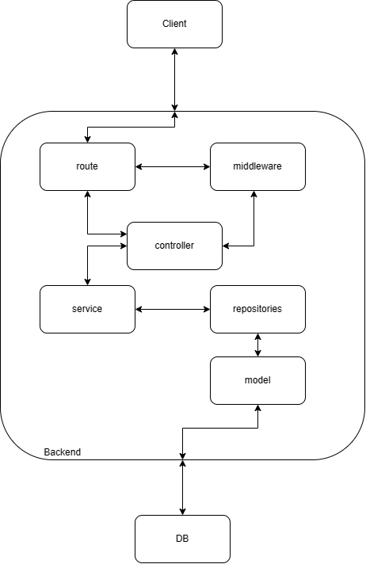

# Database Structure
In this project, I am using MongoDB (NoSQL). So, this structure is just a suggestion that is suitable for this code.

### videos
|Field       |Type    |Option         |
|------------|--------|---------------|
|_id         |ObjectId|               |
|urlThumbnail|String  |               |

### users
|Field            |Type    |Option         | 
|-----------------|--------|---------------|
|_id              |ObjectId|-              |
|email            |String  |unique,required|
|password         |String  |required       |
|username         |String  |required       |
|urlProfilePicture|String  |-              |

### products
|Field       |Type    |Option  |Ref   |
|------------|--------|--------|------|
|_id         |ObjectId|    -   |-     |
|url         |String  |required| -    |
|title       |String  |required|  -   |
|price       |Number  |required|   -  |
|videoId     |ObjectId|required|videos|

### comments
|Field       |Type    |Option  |Ref   |
|------------|--------|--------|------|
|_id         |ObjectId|    -   |-     |
|username    |String  |required| -    |
|comment     |String  |required|  -   |
|createAt    |Number  |required|   -  |
|videoId     |ObjectId|required|videos|

# API Structure



# Endpoint 
## Users
* User object
```
{
  _id: ObjectId
  username: string
  email: string
  password: string
  urlProfilePicture: string
}
```
**POST /register**
----
  Returns logged user.
* **URL Params**  
  None
* **Data Params**  
  ```
  {
    "email": string,
    "password": string,
    "username": string
  }
  ```
* **Headers**  
  Content-Type: application/json  
* **Success Response:**  
* **Code:** 200  
  **Content:**  
```
{
    "status": "success"
}
```
* **Error Response:**  
  * **Code:** 400
  **Content:** 
  ```
  {
    "status": "fail",
    "message": "email already registered"
  }
  ```
  OR  
  * **Code:** 400  
  **Content:** 
  ```
  {
    "status": "fail",
    "message": "invalid payload"
  }
  ```
**POST /login**
----
  Returns logged user.
* **URL Params**  
  None
* **Data Params**  
  ```
  {
    "email": string,
    "password": string
  }
  ```
* **Headers**  
  Content-Type: application/json  
* **Success Response:**  
* **Code:** 200  
  **Content:**  
```
{
    "status": "success",
    "token": string
}
```
* **Error Response:**  
  * **Code:** 401
  **Content:** 
  ```
  {
    "status": "fail",
    "message": "Wrong email or password"
  }
  ```
  OR  
  * **Code:** 400  
  **Content:** 
  ```
  {
    "status": "fail",
    "message": "invalid payload"
  }
  ```

**GET /users**
----
  Returns the logged user.
* **URL Params**  
* **Data Params**  
  None
* **Headers**  
  Content-Type: application/json  
  Authorization: Bearer `<OAuth Token>`
* **Success Response:** 
* **Code:** 200  
  **Content:**  
  ```
  {
    "status": "success",
    "data": {
        "email": string,
        "username": string,
        "url_profile_picture": string
    }
  }
  ```

**PUT /users/profile-pictures**
----
  Change profile pictures and return url.
* **URL Params**  
  None
* **Data Params**  
  ```
  key: 'file'
  value: file
  ```
* **Headers**  
  Content-Type: multipart/form-data  
  Authorization: Bearer `<Auth Token>`
* **Success Response:**  
* **Code:** 200  
  **Content:**  
```
{
    "status": "success",
    "data": {
        "url": string
    }
}
```
* **Error Response:**  
  * **Code:** 400  
  **Content:** 
  ```
  {
    "status": "fail",
    "message": "invalid payload"
  }
  ```
  OR  
  * **Code:** 400  
  **Content:** 
  ```
  {
    "status": "fail",
    "message": "Malformed or Missing token"
  }
  ```
  OR  
  * **Code:** 400  
  **Content:** 
  ```
  {
    "status": "fail",
    "message": "Unauthenticated"
  }
  ```
## Videos
* Video object
```
{
  _id: ObjectId
  urlThumbnail: string
}
```
**GET /videos**
----
  Returns all videos.
* **URL Params**  
* **Data Params**  
  None
* **Headers**  
  Content-Type: application/json  
* **Success Response:** 
* **Code:** 200  
  **Content:**  
  ```
  {
    "status": "success",
    "data": [ArrayOfVideoObject]
  }
  ```

## Products
* Product object
```
{
  _id: ObjectId
  url: string
  title: string
  price: Number
  videoId: ObjectId
}
```
**GET /videos/:id/products**
----
  Returns products on specified video.
* **URL Params**
  *Required:* `id=[integer]`  
* **Data Params**  
  None
* **Headers**  
  Content-Type: application/json  
* **Success Response:** 
* **Code:** 200  
  **Content:**  
  ```
  {
    "status": "success",
    "data": [ArrayOfProductObject]
  }
  ```
* **Error Response:**  
  * **Code:** 400  
  **Content:** 
  ```
  {
    "status": "fail",
    "message": "Invalid Video Id"
  }

## Comments
* Comment object
```
{
  _id: ObjectId
  username: string
  comment: string
  createdAt: Number
  videoId: ObjectId
```
**GET /videos/:id/comments**
----
  Returns comments on specified video.
* **URL Params**
  *Required:* `id=[integer]`  
* **Data Params**  
  None
* **Headers**  
  Content-Type: application/json  
* **Success Response:** 
* **Code:** 200  
  **Content:**  
  ```
  {
    "status": "success",
    "data": [ArrayOfCommentsObject]
  }
  ```
* **Error Response:**  
  * **Code:** 400  
  **Content:** 
  ```
  {
    "status": "fail",
    "message": "Invalid Video Id"
  }
  ```
**POST /videos/:id/comments**
----
  add comment on video
* **URL Params**  
  *Required:* `id=[integer]`  
* **Data Params**  
  ```
  {
    comment" string
  }
  ```
* **Headers**  
  Content-Type: aplication/json
  Authorization: Bearer `<Auth Token>`
* **Success Response:**  
* **Code:** 200  
  **Content:**  
```
{
    "status": "success",
    "data": {
        "username": string,
        "comment": string
        "created_at": number
    }
}
```
* **Error Response:**  
  * **Code:** 400  
  **Content:** 
  ```
  {
    "status": "fail",
    "message": "invalid payload"
  }
  ```
  OR  
  * **Code:** 400  
  **Content:** 
  ```
  {
    "status": "fail",
    "message": "Malformed or Missing token"
  }
  ```
  OR  
  * **Code:** 400  
  **Content:** 
  ```
  {
    "status": "fail",
    "message": "Unauthenticated"
  }
  ```

# How to run 
1. Clone this repo
```
https://github.com/sir-shalahuddin/midterm.git
```  
2. Make .env file or copy the given .env outside this repositories

3. Add all the packages
```
npm install
```
4. Run the aplication
```
npm run start
```
or start in development mode
```
npm run dev
```
